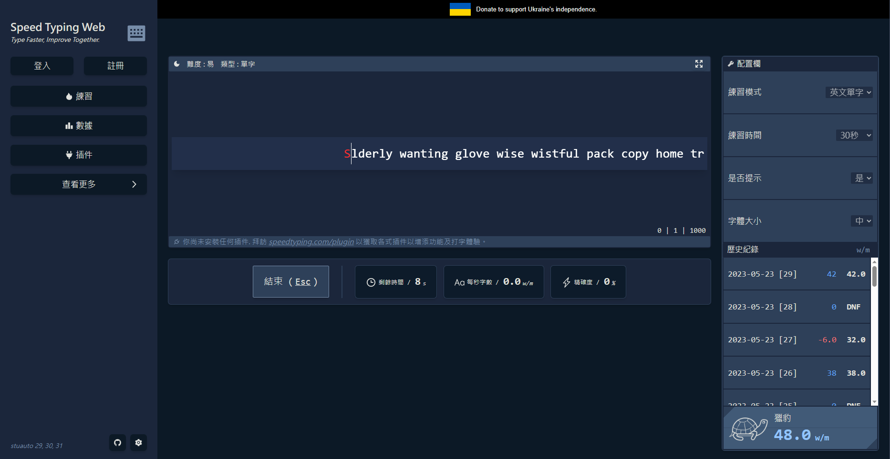

<h1 align="center">Speed Typing Web</h1>

Feature-rich typing practice and speed web application.

功能豐富的打字練習、競速網頁應用程式。

[Demo](https://dalufishe.github.io/speed-typing-web/) / [Issues](https://github.com/Dalufishe/speed-typing-web/issues) / [Pull requests](https://github.com/Dalufishe/speed-typing-web/pulls)

### 特色功能

<input type="checkbox" checked> 30 / 60 / 120 秒的英打練習！
<input type="checkbox" checked> speedrun 風格的計分榜，查看最佳紀錄，平均，單一次成績。
<input type="checkbox" checked> 高度配置項，試需求搭配最適合的練習模式。
<input type="checkbox"> 完整的數據統計，診斷練習情況，適當做調整。

